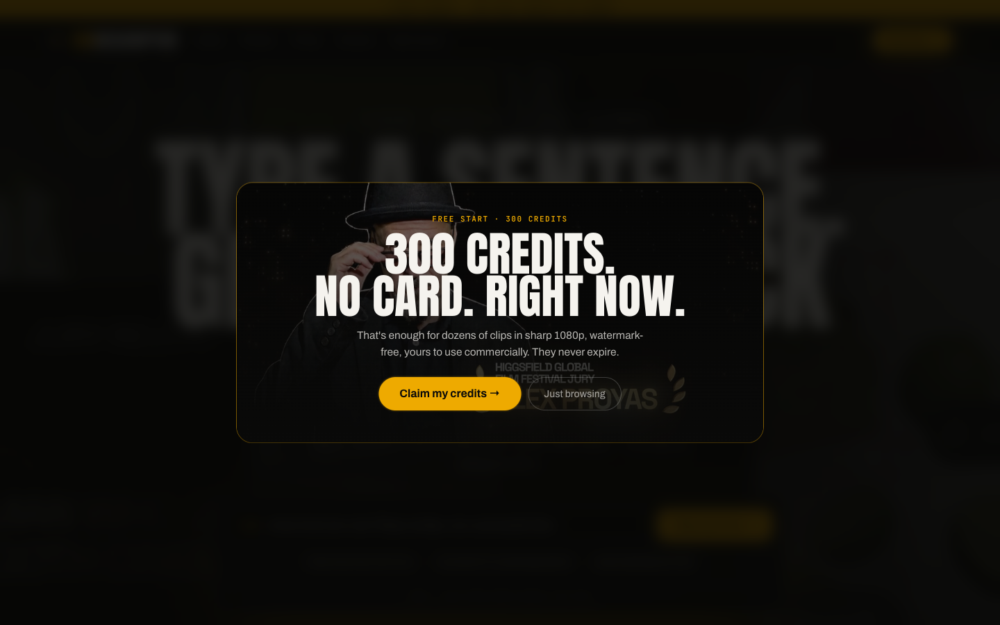

# Viddescriptor

**The open-source landing page & signup funnel for selling AI media generation under your own brand.**

Type a sentence, get back a finished, film-grade video — no crew, no editing timeline. Viddescriptor is the marketing page and signup flow that turns visitors into paying customers of your own AI media generation product: they land on a cinematic showcase, sign up for free credits, take a one-time credit upsell, and log into your own branded portal to start generating.

**Live demo: https://viddescriptor.com**



---

## What you get

- **A cinematic landing page** — sticky top bar + offer banner, hero video wall, marquee, gallery, an image-to-video before/after slider, a real 53-recipe catalog grid, and an interactive "director controls" demo, all dressed with a real AI-generated media set that's bundled in and licensed for reuse.
- **A working conversion funnel** — free-credits signup → one-time credit upsell via Stripe, wired end to end, not a mockup.
- **Character-lock & film showcase sections** that sell the product's actual capabilities.
- **Every brand element env-driven** — name, logo, hero copy, pricing, banner text, all swap through `.env`, no code edits required.
- **Bot-proof signup out of the box** — Cloudflare Turnstile, email canonicalization, and a disposable-domain blocklist, all optional and all off by default.
- **238 tests** covering the Worker API, components, and config, so a fork stays safe to customize.

> ### 🎓 Want to turn this into a business?
> Join the **AI Reseller Club** to learn how to white-label this exact stack, price and sell AI media generation for profit, and deploy it safely to maximize every signup.
>
> [](https://www.skool.com/voice-ai-mastery-5847)

## How it works

1. Your visitor lands on the page and signs up.
2. A customer account is provisioned — free credits and all — on your white-label media studio, powered by [Knotie](https://knotie-ai.pro).
3. They can optionally buy a paid credit top-up through your own Stripe account.
4. They log into **your** branded portal and start generating.

Every dollar and every credit flows through your own partner account and your own Stripe balance — Viddescriptor is just the front door.

## Quickstart A — Deploy to Cloudflare (recommended)

Recommended because production belongs on the edge: a global CDN for the bundled media, Turnstile bot protection running right at the edge, secrets that are encrypted and never bundled into your JS, your own custom domain, and it all fits comfortably inside Cloudflare's free tier.

```bash
git clone https://github.com/Kno2gether-Labs-LTD/viddescriptor.git
cd viddescriptor
npm install

cp .env.example .env          # fill in the VITE_* vars you want to override
```

Then, in order:

1. **Edit the `routes` block in `wrangler.jsonc`** — point `pattern` at your own custom domain, or delete the `routes` block entirely to deploy on your account's free `*.workers.dev` subdomain instead.
2. **`npx wrangler login`** — authenticate to your own Cloudflare account.
3. **`npm run deploy`** — runs `scripts/deploy.sh dev`, which loads `.env`, builds with `vite build`, and deploys with `wrangler deploy` — forwarding your `.env`'s `VITE_UPSELL_*`/`VITE_FREE_CREDITS` as Worker vars so `.env` is the single source of truth for both the page and the Worker (see "Configuration reference" below). The Worker is now live (signup/checkout will still fail until the next step — that's expected).
4. **`npx wrangler secret put PARTNER_API_KEY`** — paste your `pkt_…` key when prompted. Secrets apply immediately; **no redeploy is needed**.

Everything else (brand name, tagline, pricing copy, credit amounts) ships with sane Viddescriptor defaults baked into `src/config.ts`, so nothing above is strictly required beyond the partner API key.

Before you go live, work through the **Partner checklist** below — the app will deploy without it, but signup and checkout will fail against a partner account that isn't fully wired up.

## Quickstart B — Run locally with Docker

For evaluation or local development without a Cloudflare account:

```bash
cp .dev.vars.example .dev.vars   # fill in PARTNER_API_KEY for local calls to the partner API
docker compose up
```

Open **http://localhost:8787** — the full app (SPA + API) running locally, served by Cloudflare's own `workerd` runtime, the same code path as production.

This is for evaluation and local development only. Production belongs on Cloudflare — see Quickstart A for the CDN, Turnstile, and encrypted-secrets benefits Docker can't give you locally.

**🎓 Ready to make it a business? → [Join the AI Reseller Club](https://www.skool.com/voice-ai-mastery-5847)**

## Partner checklist

This app talks to your own white-label partner account, not ours. Before the signup/checkout flow can work end to end:

1. **Create a Knotie white-label partner account with Stripe Connect connected.** Payment links mint against your Connect balance — the platform's payment-links API needs a connected Stripe account on file for your partner.
2. **Mint a partner API key with `customers:write`, `payments:write`, and `payments:read` scopes.** This is the key you'll `wrangler secret put PARTNER_API_KEY` in Quickstart A — it's the only credential the Worker holds, and the SPA never sees it.
3. **Register your landing domain in Settings → approved redirect domains.** The checkout flow builds `successUrl`/`cancelUrl` from `SITE_URL`, and they must be `https://` URLs on a domain you've approved — an unapproved domain will fail to mint a payment link.
4. **Enable the Media Studio experience and grab your white-label portal subdomain.** Set `VITE_PORTAL_URL` to it — the post-signup "log in" CTA links to `{VITE_PORTAL_URL}/login`.

The credit-grant webhook that powers the upsell is already live on the platform, so once your partner account is wired up the upsell just works. Don't want it? Set `VITE_UPSELL_CREDITS=0` in your `.env` — that's the only change needed to disable it, and it skips the "double my credits" step entirely.

If any of these are missing, the Worker degrades gracefully — signup/checkout return a friendly "temporarily unavailable" error rather than leaking partner API details, and the failure is logged server-side for you to diagnose.

## Bot protection

Signup carries three independent, entirely optional layers of abuse hardening — the app runs fine with all of them off (the open-source default):

1. **Cloudflare Turnstile** — create a widget (managed mode) at [dash.cloudflare.com → Turnstile](https://dash.cloudflare.com/?to=/:account/turnstile), then set `VITE_TURNSTILE_SITE_KEY` in `.env` and `npx wrangler secret put TURNSTILE_SECRET`. Unset either one and the CAPTCHA is off — no widget renders, no `api.js` request fires, and the Worker never calls siteverify.
2. **Email canonicalization** — at signup, plus-tags are stripped (`user+1@gmail.com` → `user@gmail.com`) and, for gmail.com/googlemail.com only, dots are stripped too, to prevent free-credit farming via inbox-alias variants of one address. The welcome email still reaches the same inbox — that's what canonicalization means.
3. **Disposable-email blocklist** — a small built-in list (mailinator.com, guerrillamail.com, etc.) is always rejected; set `DISPOSABLE_EMAIL_DOMAINS` (comma-separated) to extend it, or to the literal string `off` to disable the check entirely.

## Local development (without Docker)

```bash
cp .dev.vars.example .dev.vars   # fill in PARTNER_API_KEY for local calls to the partner API
npx wrangler dev                 # full stack: Worker + Hono API + static assets, matches prod
# — or —
npm run dev                      # SPA only (vite dev), faster iteration, /api/* calls will 404
```

`.dev.vars` is gitignored and loaded automatically by `wrangler dev` — never commit real secrets to `.env` or anywhere else in the repo.

## Testing

```bash
npx vitest run     # 238 tests: worker endpoints (mocked partner API) + component + unit
npx vitest          # watch mode
npm run typecheck   # tsc --noEmit
```

Worker tests mock the partner API entirely (Nock-style fetch mocking) — no test ever calls a real Knotie or Stripe endpoint.

## Architecture

```
                         ┌─────────────────────────────────────────┐
                         │            Cloudflare Worker             │
                         │                                           │
  Browser  ── GET / ───▶ │  ASSETS binding → dist/ (Vite build)     │
                         │  React SPA: Hero, Recipes, Pricing, ...  │
                         │                                           │
  Browser  ── POST ────▶ │  Hono API (worker/index.ts)              │
           /api/signup   │    ├─ /api/signup   → partner /onboard   │──▶  White-label
           /api/checkout │    ├─ /api/checkout → partner /payment-  │     platform API
           /api/verify   │    │                    links (mint)     │     (your account,
                         │    └─ /api/verify   → partner /payment-  │      your Stripe
                         │                          links/{id} (GET)│      Connect balance)
                         │                                           │
                         │  PARTNER_API_KEY (Worker secret, never    │
                         │  bundled into client JS, never sent to    │
                         │  the browser) sent server-side — two      │
                         │  transports are supported, see            │
                         │  PARTNER_API_STYLE below                  │
                         │                                           │
                         │  Per-IP fixed-window rate limiter         │
                         │  (in-memory, per isolate) on all 3 routes │
                         └─────────────────────────────────────────┘
```

- **The Worker is the only thing that ever holds `PARTNER_API_KEY`.** The SPA calls same-origin `/api/*` routes; the Worker attaches the key server-side via `worker/partnerApi.ts` before calling out to `PARTNER_API_BASE`.
- **Payment verification is never trusted from the redirect URL.** `/api/checkout` returns an `intentId` the client stashes client-side; after the Stripe redirect back, the client calls `GET /api/verify?intent=…`, which re-reads the authoritative status from the partner platform (backed by its own webhook-confirmed truth) — not from query-string state.
- **The upsell credit grant is platform-side.** When `UPSELL_CREDITS` (Worker var) is greater than zero, `/api/checkout` includes `features.initialAiCredits` on the payment-link mint request; the partner platform's payment-link webhook applies the grant once the payment is confirmed. `.env` is the single source for this — `VITE_UPSELL_CREDITS` drives both the page copy and (via `scripts/deploy.sh`) the Worker's `UPSELL_CREDITS`, so they can never drift out of sync.
- **Static assets are served straight off Cloudflare's edge** via the Workers `ASSETS` binding (`not_found_handling: single-page-application` — client-side routing works, unknown paths fall back to `index.html`).

## Configuration reference

Everything is `.env`-driven. Public `VITE_*` vars are build-time only — they get bundled into the client JS by Vite, so never put a secret in one. For the upsell offer and `FREE_CREDITS`/`ONBOARD_FEATURES_JSON`, `.env` is also the **single source of truth for the Worker**: `npm run deploy` / `npm run deploy:prod` (`scripts/deploy.sh`) forward the matching `VITE_*` values to `wrangler deploy --var`, so changing the offer only ever means editing `.env`. Worker vars in `wrangler.jsonc` under `vars` are the fallback defaults used when a var is left unset in `.env` — they're not a second source to keep in sync by hand. Worker secrets are set with `wrangler secret put` (production) or `.dev.vars` (local) and are never bundled into anything the browser can read, and are never read from `.env` or forwarded by `scripts/deploy.sh`.

### Public build-time config (`VITE_*`, set in `.env`)

| Variable | Default | Purpose |
|---|---|---|
| `VITE_BRAND_NAME` | `Viddescriptor` | Wordmark, `<title>`, copy substitutions |
| `VITE_BRAND_ACCENT_SPLIT` | `VID,DESCRIPTOR` | Two comma-separated parts for the split-color wordmark; falls back to default unless exactly two non-empty parts are given |
| `VITE_TAGLINE` | *(bundled Viddescriptor line)* | Hero subtitle / one-line pitch |
| `VITE_LOGO_URL` | *(unset — text wordmark)* | Optional logo image URL |
| `VITE_SITE_URL` | `https://viddescriptor.kno2gether.com` | Canonical URL; also used to build the Worker's payment success/cancel redirect target (see `SITE_URL` below — keep these in sync) |
| `VITE_SUPPORT_EMAIL` | `support@kno2gether.com` | Footer + error-state contact address |
| `VITE_PORTAL_URL` | `https://viddescriptor.kno2gether.com` | White-label portal base URL; the post-signup "log in" CTA links to `{VITE_PORTAL_URL}/login` — **set this before going live** |
| `VITE_GITHUB_URL` | `https://github.com/Kno2gether-Labs-LTD/viddescriptor` | Open-source backlink; point at your own fork |
| `VITE_RESELLER_CLUB_URL` | `https://www.skool.com/voice-ai-mastery-5847` | Secondary "learn to sell this" link under the GitHub button; set to an empty string to hide it |
| `VITE_SOCIALS_JSON` | `[]` | JSON array of extra footer social links, e.g. `[{"label":"X","href":"https://x.com/you"}]` |
| `VITE_FREE_CREDITS` | `300` | Free credits granted on signup — shown in copy *and* sent as the onboarding grant amount; keep equal to the Worker's `FREE_CREDITS` |
| `VITE_UPSELL_AMOUNT_CENTS` | `900` | Upsell price in integer cents (e.g. `900` = $9.00, `950` = €9.50) — **single source**, also forwarded to the Worker's `UPSELL_AMOUNT_CENTS` by `scripts/deploy.sh` |
| `VITE_UPSELL_CURRENCY` | `usd` | ISO 4217 currency code — **single source**, also forwarded to the Worker's `UPSELL_CURRENCY` |
| `VITE_UPSELL_CREDITS` | `500` | Upsell credit amount — **single source**, also forwarded to the Worker's `UPSELL_CREDITS` (the value actually granted). `<= 0` skips the upsell step entirely — see the partner checklist above |
| `VITE_UPSELL_AMOUNT_LABEL` | *(derived, e.g. `$9`)* | Optional override for the displayed price copy; wins over the label derived from `VITE_UPSELL_AMOUNT_CENTS`/`VITE_UPSELL_CURRENCY` when set |
| `VITE_UPSELL_FROM_TO` | *(derived, e.g. `300 → 800`)* | Optional override for the "before/after" credits copy; wins over the value derived from `VITE_FREE_CREDITS`/`VITE_UPSELL_CREDITS` when set |
| `VITE_OFFER_ENDS_AT` | *(unset)* | ISO 8601 date/time; when unset, all countdown/urgency UI stays hidden — no fabricated urgency ships by default |
| `VITE_BANNER_TEXT` | `OPEN SOURCE · {freeCredits} FREE CREDITS ON SIGNUP` | Top-bar / sticky-CTA banner line; `{freeCredits}` is interpolated with the resolved `VITE_FREE_CREDITS` |
| `VITE_PRICING_JSON` | *(bundled pricing cards)* | Optional JSON blob that fully replaces the default pay-as-you-go + plan cards: `{"payg":[{"kicker","price","per?","lines":[...],"cta","featured?"}],"plans":[...]}`; invalid JSON is ignored and the default is used instead |
| `VITE_SHOW_SAMPLE_SOCIAL_PROOF` | `false` | Gates the FreeFilm/OpenSource stat blocks — enable only with real, owner-supplied numbers |
| `VITE_TESTIMONIALS_JSON` | `[]` | JSON array of real, owner-supplied Compare-section testimonial quotes, e.g. `[{"quote":"...","attribution":"A REAL CUSTOMER"}]`; the testimonial cards render only when this is non-empty — never fabricated |
| `VITE_TURNSTILE_SITE_KEY` | *(unset — disabled)* | Public Cloudflare Turnstile sitekey; see "Bot protection" above. Unset = no widget, no `api.js` request |

### Worker vars (non-secret, `wrangler.jsonc` → `vars`)

| Variable | Default | Purpose |
|---|---|---|
| `PARTNER_API_BASE` | `https://app.knotie-ai.pro` | Base URL of the partner platform transport |
| `PARTNER_API_STYLE` | `direct` (the default) | Two transports are supported to call the partner platform with the same `pkt_…` key: `direct` (default) hits the app's `/api/partner/...` routes with `x-api-key: <key>`; `gateway` hits the MCP gateway's `/api/partner-rest/tools/<tool>` routes with `Authorization: Bearer <key>`. To use gateway, set this to `gateway` **and** `PARTNER_API_BASE` to `https://mcp.knotie-ai.pro` |
| `EXPERIENCE_TYPE` | `media_studio` | Experience passed on customer onboarding |
| `FREE_CREDITS` | `300` — **fallback only; `.env`'s `VITE_FREE_CREDITS` is the single source**, forwarded here by `scripts/deploy.sh` | Credits granted on signup (server-side truth) |
| `UPSELL_AMOUNT_CENTS` | `900` — **fallback only; `.env`'s `VITE_UPSELL_AMOUNT_CENTS` is the single source** | Upsell price in cents, sent to the payment-link mint call |
| `UPSELL_CURRENCY` | `usd` — **fallback only; `.env`'s `VITE_UPSELL_CURRENCY` is the single source** | Upsell currency |
| `UPSELL_CREDITS` | `500` — **fallback only; `.env`'s `VITE_UPSELL_CREDITS` is the single source**, forwarded here by `scripts/deploy.sh` at deploy time | Credits actually granted by the upsell; `0` omits the grant entirely and the client skips the upsell step |
| `SITE_URL` | `https://viddescriptor.kno2gether.com` | Used to build the payment-link `successUrl`/`cancelUrl` — must be an approved redirect domain on your partner account |

To change the deployed domain, edit the `routes` block in `wrangler.jsonc`:

```jsonc
"routes": [{ "pattern": "yourdomain.com", "custom_domain": true }]
```

### Worker secrets (never in `.env` — `wrangler secret put`, or `.dev.vars` locally)

| Variable | Purpose |
|---|---|
| `PARTNER_API_KEY` | `pkt_…` key with `customers:write`, `payments:write`, `payments:read` scopes — the only credential that authenticates the Worker to your partner account |
| `FREE_PLAN_ID` | Optional: plan id applied at onboarding, if you want signups to land on a specific plan rather than the platform default |
| `TURNSTILE_SECRET` | Optional: Cloudflare Turnstile secret key; see "Bot protection" above. Unset = the `/api/signup` Turnstile check is skipped entirely |

Non-secret but not in `wrangler.jsonc`'s `vars` block either (both default to "off"/unset behavior, so nothing to set unless you want to customize): `DISPOSABLE_EMAIL_DOMAINS` — comma-separated domains that EXTEND the built-in disposable-email blocklist, or the literal string `off` to disable the check entirely (including the built-in list). Set with `wrangler deploy --var DISPOSABLE_EMAIL_DOMAINS:...` or add it to `wrangler.jsonc`'s `vars`.

## Media

The clips bundled under `public/media/` are AI-generated originals shipped with this template so the default deployment looks finished out of the box. They're free to use, modify, or replace as part of your deployment, but are not licensed for standalone resale as stock footage — see [`LICENSE-MEDIA.md`](LICENSE-MEDIA.md) for the exact terms. Swap in your own media any time; nothing in the app hard-codes these files.

## We can deploy and manage it for you

Don't want to run your own Cloudflare Worker? We'll deploy, brand, and operate Viddescriptor for you on your domain. Reach out: **support@kno2gether.com**.

## Deploying to two Cloudflare accounts (dev + production)

A Worker custom domain must live on the **same** Cloudflare account as the zone —
a CNAME from a zone on account A to a Worker on account B fails with error 1014.
If your dev subdomain and your production domain sit on different accounts:

```bash
npm run cf:login:dev    # wrangler login as the dev-zone account, saved as profile "dev"
npm run cf:login:prod   # wrangler login as the production-zone account, saved as "prod"
npm run deploy          # dev  → routes in wrangler.jsonc (top level)
npm run deploy:prod     # prod → routes in wrangler.jsonc env.production
npm run cf:secret:prod  # set PARTNER_API_KEY on the production Worker
```

Profiles are plain wrangler token files under `~/.wrangler-profiles/` swapped by
`scripts/cf-profile.sh` (wrangler holds one active login). Edit both `routes`
blocks and `SITE_URL` in `wrangler.jsonc` for your domains. If a hostname already
has a manual A/CNAME record, delete it in the Cloudflare DNS dashboard first —
wrangler creates the records itself (error 100117 otherwise).

## License

Code is [MIT licensed](LICENSE) — copyright 2026 Kno2gether / Knolabs. Bundled media is licensed separately under [`LICENSE-MEDIA.md`](LICENSE-MEDIA.md).

---

**🎓 Want to build a business on this?** → [Join the AI Reseller Club](https://www.skool.com/voice-ai-mastery-5847)
